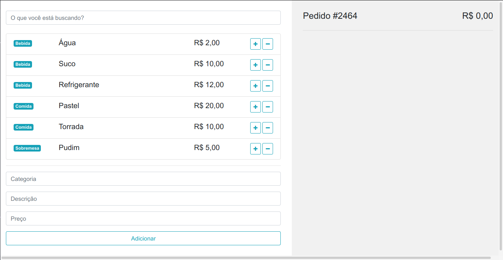
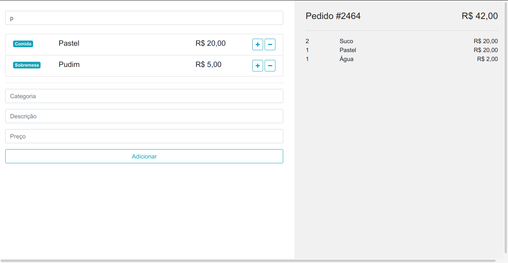

# Comandas de Produtos - Do front ao back com JS

## :rocket: Tecnologias usadas
Este maravilhoso projeto está sendo desenvolvido com as seguintes tecnologias:

- [HTML5]
- [CSS3]
- [Bootstrap]
- [JavaScript]
- [Vue.js]
- [Node.js]
- [Nodemon]
- [ApolloServer]
- [GraphQL]
- [MySQL]

## :computer: Projeto

Projeto desenvolvido durante uma live com Rodrigo Branas no canal [DevBage](https://www.youtube.com/channel/UCILT04KRKUNZeMvq89B-BAA). Aplicação fullstack que permite cadastrar, pesquisar e inserir produtos numa comanda.

## Frontend

<h1 align="center"></img></h1>

<h1 align="center"></img></h1>

## Instalação
Clone este repositório para uma pasta ex: `vue-front-back`
```sh
git clone https://github.com/henrique-brites/vue-front-back.git
cd vue-front-back
```
### Server/API
Instale as dependências dentro da pasta `server`
```sh
cd server
npm install
```
- No arquivo `.env` incluir os dados de conexão com o banco de dados **MySQL**, no arquivo `server/database.sql` tem o backup do banco de dados

### Rodar Server/API
```
npm start
```
> Lembre-se de deixar rodando o backend...

### Client/Frontend
Instale as dependências dentro da pasta `client`
> Em um novo terminal execute os comandos:
```sh
cd client
npm install
```
### Rodar Frontend
```
npm run serve
```

## :memo: Licença

Esse projeto está sob a licença MIT. Veja o arquivo [LICENSE](LICENSE) para mais detalhes.

---


Feito com :green_heart: by  Henrique Brites :wave:

